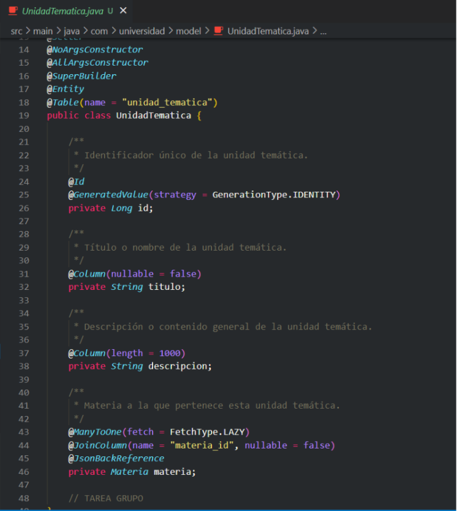

# Documentación de Modificaciones – Tarea Parte 1

## Relaciones One-to-Many y Cascadas

### Participantes del Grupo
- **Picavia Saravia Julio Erick**
- **Carlos Javier Callizaya Rosas**
- **Mendez Vargas Amiel Natanaeli**
- **Fernandez Flores Adriana Valeria**
- **Aruquipa Ururi Luz Edely**
- **Iver Mamani Cordero**

---

## Cambios y Creaciones Realizadas

### 1. Creación de la Entidad `UnidadTematica` (Realizado por Fernandez Adriana)
Se desarrolló la clase `UnidadTematica.java` con los siguientes campos:
- `id`
- `titulo`
- `descripcion`
- Relación con la entidad `Materia` mediante `@ManyToOne`.

Además, se utilizó la anotación `@JsonBackReference` para evitar ciclos de serialización.

```java
@Entity
@Data
@SuperBuilder
@NoArgsConstructor
@AllArgsConstructor
public class UnidadTematica {
    @Id
    @GeneratedValue(strategy = GenerationType.IDENTITY)
    private Long id;
    private String titulo;
    private String descripcion;

    @ManyToOne
    @JoinColumn(name = "materia_id")
    @JsonBackReference
    private Materia materia;
}
```



### 2. Modificación de la Entidad `Materia` (Realizado por Fernandez Adriana)

Se incorporó la siguiente lista de unidades temáticas:  
Esta relación permite vincular múltiples unidades temáticas a una sola materia.

```java

@OneToMany(mappedBy = "materia", cascade = CascadeType.ALL, orphanRemoval = true)
private List<UnidadTematica> unidades = new ArrayList<>();
```

### 3. Creación de los DTOs (Realizado por Fernandez Adriana)
Se añadieron los siguientes DTOs:  
UnidadTematicaDTO.java: incluye id, titulo y descripcion.  

MateriaDTO.java: se amplió para incluir el campo:  

private List<UnidadTematicaDTO> unidadesTematicas;


### 4. Creación del Repositorio `UnidadTematicaRepository` (Realizado por Picavia Julio Erick)

Se creó la interfaz `UnidadTematicaRepository`, que extiende de `JpaRepository`. Esta incluye el método:

`List<UnidadTematica> findByMateriaId(Long materiaId);`

Este método permite obtener todas las unidades temáticas asociadas a una materia específica mediante su ID.


### 5. Creación de la Interfaz y Servicio de `UnidadTematica` (Realizado por Picavia Julio Erick)

#### Interfaz `IUnidadTematicaService.java`
Define el método:
- `List<UnidadTematicaDTO> obtenerPorMateria(Long materiaId);`  
  Este método permite obtener una lista de unidades temáticas asociadas a una materia específica.

#### Implementación `UnidadTematicaServiceImpl.java`
Se implementó la lógica del método en la clase de servicio:
- `List<UnidadTematicaDTO> obtenerPorMateria(Long materiaId);`  
  Aquí se realiza la lógica necesaria para recuperar y transformar las unidades temáticas asociadas a una materia.


### 6. Modificación en la Interfaz `IMateriaService`

Se añadió el siguiente método a la interfaz `IMateriaService`:

`List<MateriaDTO> listarMateriasConUnidades();`

Este método permite listar todas las materias junto con sus respectivas unidades temáticas.


### 7. Modificación en `MateriaServiceImpl`

Se implementó el método `listarMateriasConUnidades()` con el objetivo de retornar cada materia junto con sus unidades temáticas convertidas en DTOs.  

Para garantizar la carga de relaciones `Lazy`, se utilizó la anotación `@Transactional`:

`@Override`  
`@Transactional`  
`public List<MateriaDTO> listarMateriasConUnidades() { ... }`


### 8. Modificación en `MateriaController`

Se incluyó el siguiente endpoint para listar todas las materias junto con sus unidades temáticas:

`@GetMapping("/con-unidades")`  
`public List<MateriaDTO> listarMateriasConUnidades() {`  
&nbsp;&nbsp;&nbsp;&nbsp;`return materiaService.listarMateriasConUnidades();`  
`}`


### 9. Creación del Controlador `UnidadTematicaController` (Realizado por Fernandez Adriana)

Se agregó el endpoint para listar las unidades temáticas asociadas a una materia específica:

`@GetMapping("/materia/{materiaId}")`  
`public List<UnidadTematicaDTO> listarPorMateria(@PathVariable Long materiaId) {`  
&nbsp;&nbsp;&nbsp;&nbsp;`return service.obtenerPorMateria(materiaId);`  
`}`


### Extras Implementados (Realizado por Fernandez Adriana)

Se cumplió con el requerimiento adicional de listar todas las materias con sus respectivas unidades temáticas utilizando el endpoint:

`GET /api/materias/con-unidades`


## Parte 2: Actualización en Cascada (`CascadeType.ALL`)

### Ejercicio 2 – Reemplazo de Unidades Temáticas en Cascada

#### 1. Creación del Endpoint `PUT /materias/{id}/unidades` (Realizado por Mendez Amiel)

Se implementó un endpoint `PUT /api/materias/{id}/unidades` que permite reemplazar por completo las unidades temáticas de una materia.  

Esto se logró utilizando las anotaciones `cascade = CascadeType.ALL` y `orphanRemoval = true`, de forma que:
- Las unidades anteriores se eliminan automáticamente.
- Las nuevas unidades se guardan al mismo tiempo que la materia.
- Se evitó guardar duplicados utilizando `.distinct()`.

#### En `IMateriaService` se implementó:
```java
MateriaDTO reemplazarUnidadesTematicas(Long id, List<UnidadTematicaDTO> nuevasUnidades);
```


### 2. Configuración de la Relación con `cascade` y `orphanRemoval` (Realizado por Mendez Amiel)

La relación `OneToMany` ya estaba definida correctamente así:

`@OneToMany(mappedBy = "materia", cascade = CascadeType.ALL, orphanRemoval = true)`  


Esto permite:  
- **Eliminar automáticamente** unidades que se eliminen de la lista (`orphanRemoval`).  
- **Guardar nuevas unidades** junto con la materia (`cascade`).  

### 3. Lógica de Reemplazo en el Servicio (Realizado por Mendez Amiel)

En `MateriaServiceImpl.java` se creó el método `reemplazarUnidadesTematicas(...)` que:  
- Elimina las unidades anteriores con `materia.getUnidades().clear()`.  
- Agrega nuevas unidades desde la lista recibida.  
- Guarda la materia en cascada.  
- Usa `.distinct()` para evitar duplicados.


Creamos el endpoint en el controlador MateriaController.java:


### 4. Prueba en Postman (Realizado por Mendez Amiel)

Se probó el endpoint `PUT /materias/1/unidades` enviando una nueva lista de unidades temáticas en formato JSON.  

La solicitud reemplazó correctamente las unidades anteriores por las nuevas (ejemplo: Trigonometría y Álgebra Lineal).  

El resultado fue exitoso (`200 OK`), validando el uso de `cascade = ALL` y `orphanRemoval = true`.